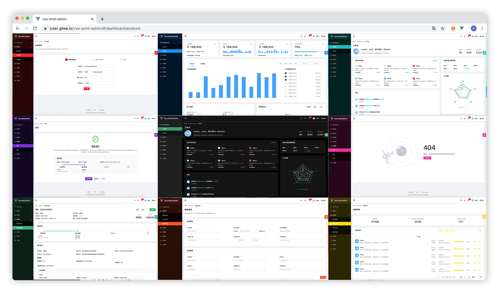

# 职级评审管理系统

#### 介绍

职级评审管理系统

#### 文档链接

【腾讯文档】【思维导图】人事处——职级评定、岗位聘任、绩效考核系统——详细规划
https://docs.qq.com/mind/DTVBvSHFITHF3UlRh

【腾讯文档】【流程图】职级评审前端业务流程图
https://docs.qq.com/flowchart/DSnRZTk9haWtiaW9S

【腾讯文档】职级评审前端页面按权限功能模块分类
https://docs.qq.com/flowchart/DSnV0Qk9sbGFaVFBl

示例项目：地址
http://192.168.1.218/static/sau_title/index.html
admin admin

### 图标库

https://www.iconfont.cn/

#### 使用 svg 图标和 antd 图标

使用 svg 图标需要复制 svg 代码, 在@/assets/svg 文件夹新建一个.scg 文件 然后复制进去
使用的时候有两种使用方法 1.组件引入 <a-icon :component="svgurl"/> 引入图标 2.使用 imagebtn 组件 这个是用来做 svg 图标的按钮

### 开发文档：

#### antd vue admin 文档

https://iczer.gitee.io/vue-antd-admin-docs/

#### antd vue 组件库文档

https://antdv.com/docs/vue/introduce-cn/

### 任务分配,进度管理文档

https://www.yuque.com/docs/share/f30ecff3-3c9a-4884-be7f-13c4259ce255?# 《📁 职级评定系统前端开发进度》

### 自定义组件

#### imageBtn

### 安装教程

1.  克隆仓库

```shell
$ git clone git@gitee.com:vtszgj-development-team/vtszgj-front-end.git
```

2.  安装依赖，推荐使用 yarn 安装依赖。

```shell
$ yarn
```

3.  启动项目

```shell
$ npm start
```

4.  账号密码

```shell
$ 教务 jiaowu jiaowu
```

### 自定义组件

#### 自定义 svg 图标的 button

```javascript
// 引入
import ImageButton from "@/components/imageBtn";
<ImageButton :src="excel_svg" @click="showModal" :text="'导入'"/>
// 使用
/*
src: 传入svg地址
text: 按钮text
@click: 点击事件
*/
```

#### 使用说明

1.  使用 master 分支进行开发
2.  完成一个阶段需要创建版本分支

# UI 库介绍

简体中文 | [English](./README.en-US.md)

<h1 align="center">Vue Antd Admin</h1>

<div align="center">
  
[Ant Design Pro](https://github.com/ant-design/ant-design-pro) 的 Vue 实现版本  
开箱即用的中后台前端/设计解决方案

[](https://github.com/iczer/vue-antd-admin/blob/master/LICENSE)
[](https://david-dm.org/iczer/vue-antd-admin)
[](https://david-dm.org/iczer/vue-antd-admin?type=dev)
[](https://github.com/iczer/vue-antd-admin/releases/latest)


多种主题模式可选：  


</div>

- 预览地址：https://iczer.gitee.io/vue-antd-admin
- 使用文档：https://iczer.gitee.io/vue-antd-admin-docs
- 常见问题：https://iczer.gitee.io/vue-antd-admin-docs/start/faq.html
- 国内镜像：https://gitee.com/iczer/vue-antd-admin

## 浏览器支持

现代浏览器及 IE10

| [](http://godban.github.io/browsers-support-badges/)</br>IE / Edge | [](http://godban.github.io/browsers-support-badges/)</br>Firefox | [](http://godban.github.io/browsers-support-badges/)</br>Chrome | [](http://godban.github.io/browsers-support-badges/)</br>Safari | [](http://godban.github.io/browsers-support-badges/)</br>Opera |
| --------------------------------------------------------------------------------------------------------------------------------------------------------------------------------------------------------------- | ----------------------------------------------------------------------------------------------------------------------------------------------------------------------------------------------------------------- | ------------------------------------------------------------------------------------------------------------------------------------------------------------------------------------------------------------- | ------------------------------------------------------------------------------------------------------------------------------------------------------------------------------------------------------------- | --------------------------------------------------------------------------------------------------------------------------------------------------------------------------------------------------------- |
| IE10, Edge                                                                                                                                                                                                      | last 2 versions                                                                                                                                                                                                   | last 2 versions                                                                                                                                                                                               | last 2 versions                                                                                                                                                                                               | last 2 versions                                                                                                                                                                                           |

## 使用

### clone

```bash
$ git clone https://github.com/iczer/vue-antd-admin.git
```

### yarn

```bash
$ yarn install
$ yarn serve
```

### or npm

```
$ npm install
$ npm run serve
```

更多信息参考 [使用文档](https://iczer.gitee.io/vue-antd-admin-docs)
